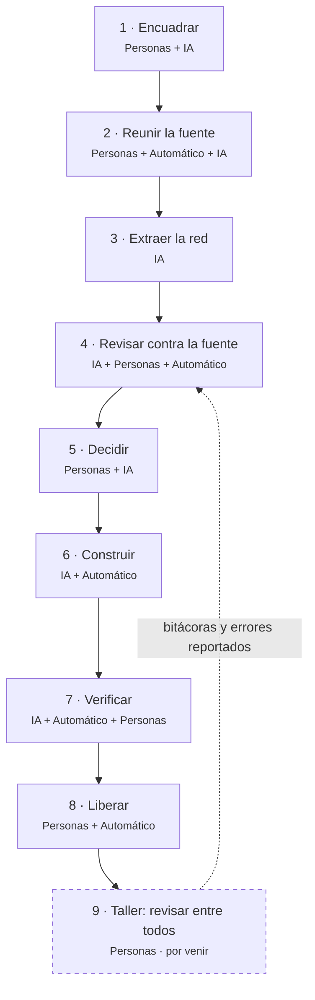

# Metodología y declaración de uso de IA

> v1.0 (2026-09-28) · [ADR-0006](decisiones/ADR-0006-declarar-uso-de-ia-con-git-como-evidencia.md) · issue #37.
> En el sitio es la página **«Cómo lo hicimos»** (`#/metodologia`). Las fases viven en
> `web/src/lib/metodologia.ts` y las cifras de git en `web/src/lib/evidencia.json`, generado por
> `uv run scripts/evidencia_git.py`. Este documento y esos archivos dicen lo mismo.

## Advertencia

**Este contenido se generó con inteligencia artificial y aún no se ha revisado al 100 %.** Esto
incluye:
- la red de políticas e instrumentos;
- los textos del sitio y el glosario;
- los materiales del taller.

Todo se produjo con modelos de IA bajo la dirección del equipo. Lo revisamos por partes, con agentes
que buscan errores y con lectura humana, pero la revisión humana completa todavía no está hecha.

No es un descuido: es el punto del ejercicio. El laboratorio es también una práctica de **cómo
interactuar con la máquina y elaborar artefactos para colaborar**. La máquina produce un borrador
rápido y verificable, y las personas lo contrastan, lo discuten y lo corrigen. El taller es la
revisión que falta.

## Seis reglas de trabajo

1. **La máquina propone, las personas deciden.** La IA plantea opciones con sus costos y el equipo
   elige y aprueba.
2. **Todo cambio deja rastro:**
   - el trabajo empieza en un issue;
   - la decisión queda en un ADR;
   - el cambio queda en un commit que declara si participó la IA;
   - la integración pasa por un PR aprobado;
   - la versión queda en un tag.

   Así trabajamos desde la v0.1.0 (PR #7). Al arranque, los cambios se subieron directo a `main`, sin
   PR, incluida la reconstrucción de la red que se publica hoy.
3. **Un contrato entre la extracción y el sitio.** Los datos llegan a la web solo si cumplen un
   esquema validado automáticamente ([FRONTERAS](FRONTERAS.md)).
4. **Una revisión que busca errores.** Desde que adoptamos la disciplina de trabajo (ADR-0001), un
   agente verificador revisa los cambios. Antes, otros agentes contrastaron la **primera extracción
   (Gemini)** con los informes y dejaron correcciones con evidencia (`data/correcciones/`). La red
   vigente, reconstruida con Claude, la reemplazó y **no pasó por esa revisión**.
5. **Los huecos se declaran.** Lo que la fuente no dice se escribe «Sin dato» (ADR-0005).
6. **El taller es la revisión que falta.** Los hallazgos de los grupos corrigen el mapa.

## El flujo



| Fase | Personas | Máquina | Rastro en git |
|---|---|---|---|
| **1. Encuadrar** | Definen la pregunta, el marco teórico y la actividad del seminario. | La IA ordena y redacta el encuadre a partir de las conversaciones. | Issue por trabajo; [`encuadre-actividad-trama.md`](encuadre-actividad-trama.md). |
| **2. Reunir la fuente** | Eligen la fuente (informes de empalme del DNP) y el sector piloto. | Scripts escritos con IA descargan y pasan a texto; Gemini transcribe los PDF escaneados. | Scripts de `extraccion/`. |
| **3. Extraer la red** | Revisan resultados y piden rehacer cuando la red sale desconectada. | La IA propone políticas, instrumentos, tipo NATO, modo de cambio y narrativa con página. Primero lo hizo Gemini; luego agentes de Claude reconstruyeron la red que se publica hoy. | El dataset y su script en el mismo commit. |
| **4. Revisar contra la fuente** | Aprueban las áreas (ADR-0004), que sí se aplican a la red vigente. La revisión dato por dato está **pendiente**. | Agentes de IA contrastaron la versión Gemini con los informes; esa red se reemplazó y la actual no pasó por esa revisión. | `data/correcciones/`: correcciones de la versión Gemini y `areas.yaml`. |
| **5. Decidir** | Deciden entre las opciones y aprueban. | La IA propone alternativas y redacta el registro. | Un ADR en `docs/decisiones/`. |
| **6. Construir** | Piden cada pieza y prueban. | La IA escribe casi todo el código y los textos; tests y contrato los validan. | Commits con `Co-Authored-By`. |
| **7. Verificar** | Leen hallazgos y el PR. | Desde ADR-0001, el agente verificador busca errores y CI corre tests, tipos y fronteras. | Commits «hallazgos del verificador»; checks del PR. |
| **8. Liberar** | Desde la v0.1.0 aprueban cada integración y versión; antes se subía directo. | GitHub Pages publica lo que llega a `main`. | Merge de PR; tag por versión. |
| **9. Taller** *(por venir)* | Los grupos contrastan, llenan la bitácora y reportan errores. | El lector convierte la bitácora en dato; lo que cambia vuelve a «Revisar». | `data/bitacoras/` e issues. |

El flujo de trabajo del equipo (encuadrar, decidir, ejecutar, liberar, retroalimentar) está en
[`.claude/skills/flujo`](../.claude/skills/flujo/SKILL.md) y [CONTRIBUTING](../CONTRIBUTING.md).

## Git es la evidencia

Git guarda de cada commit quién lo firmó, cuándo y, con el trailer `Co-Authored-By`, qué modelo
participó. Hay tres tipos de autoría:

- **Agente:** commits firmados por `Claude`. Los hace el agente en sesiones en la nube.
- **Persona con IA:** commits del PO con Claude como coautor (según el equipo, de sesiones locales).
- **Persona:** commits sin IA declarada.

Además, cada **PR integrado** es una aprobación, cada **tag** una versión y cada **ADR** una decisión.

Las cifras no se copian aquí porque envejecen con cada commit. Están en la página y en
`web/src/lib/evidencia.json`. Para verificarlas:

```bash
git log --format='%h %an · %(trailers:key=Co-Authored-By,valueonly)'
uv run scripts/evidencia_git.py          # regenera la foto (clon completo con tags)
```

El script también verifica los **hitos** de cada fase: una lista curada de hashes. El autor, la
fecha y la coautoría de cada hito los lee de git. Si un hito desaparece de la historia, el script
falla.

**Lo que git no dice:**
- De quién fue cada idea. Las conversaciones con la IA no quedan en el repo; las decisiones sí,
  en issues y ADR.
- Cuánto se revisó un texto.
- Quién pulsó «merge». Los PR se integran con la cuenta del PO; según el equipo, algunos los ejecutó
  el agente con su autorización.

Git sí muestra algo que conviene declarar: antes de la v0.1.0 los cambios se subieron directo a
`main`, sin PR (`git log --first-parent origin/main`).

## Declaración de uso de IA

**Herramientas:**
- **Claude** (Anthropic), vía Claude Code. Redactó el código, los textos y la documentación.
  Reconstruyó la red leyendo los informes y, desde ADR-0001, revisa los cambios. Trabajó con agentes de roles
  separados: `architect` (documentos), `coder` (código) y `verifier` (revisión adversarial). Están
  en `.claude/agents/`.
- **Gemini** (Google). Transcribió los PDF escaneados y produjo una primera extracción, que luego se
  reemplazó (`extraccion/extraer_instrumentos.py`, legado).

**Lo que hizo la IA:**
- extraer y clasificar;
- escribir casi todo el código y los textos;
- proponer opciones de diseño;
- revisar buscando errores.

**Lo que hicimos las personas** (testimonio del equipo; git registra las aprobaciones y decisiones):
- plantear la pregunta, el marco teórico y la actividad;
- elegir la fuente y el sector piloto;
- escribir el ejemplo CTeI de la bitácora;
- decidir y aprobar cada integración y versión;
- probar y pedir correcciones;
- conducir el taller e integrar las bitácoras.

**Lo que la IA no decide:**
- No evalúa gobiernos.
- No publica por su cuenta: desde la v0.1.0 todo pasa por un PR que aprueba el PO.
- No rellena huecos.
- No escribe las bitácoras de los grupos.

**Estado de revisión por capa** (la fuente de verdad es `CAPAS` en `web/src/lib/metodologia.ts`):

| Capa | Quién la produjo | Revisión |
|---|---|---|
| Informes de empalme | Cada gobierno (DNP) | Fuente oficial, sin modificar |
| Texto extraído | Automático; OCR con Gemini | Sin revisión humana línea a línea |
| La red | IA: agentes de Claude, con evidencia por página | Sin revisión humana. La revisión adversarial fue sobre la versión Gemini, ya reemplazada |
| Áreas de política | Propuestas con IA | Parcial: aprobadas por el equipo |
| Textos del sitio, glosario y teoría | IA desde el encuadre | Parcial: citas por verificar |
| Código y materiales | IA | Parcial: tests, contrato, verificador y pruebas del equipo |
| Ejemplo de bitácora CTeI | El equipo; la IA lo pasó al formato | Escrito por personas |
| Bitácoras de los grupos | Los grupos | Escritas por personas |

**Dónde va la advertencia:**
- la franja bajo la cabecera de todas las páginas (menos esta, que la desarrolla);
- esta metodología;
- la hoja Léeme del Excel de la red.

**¿Un error?** Díganlo en el taller o abran un issue en GitHub, con qué está mal y dónde lo vieron.
