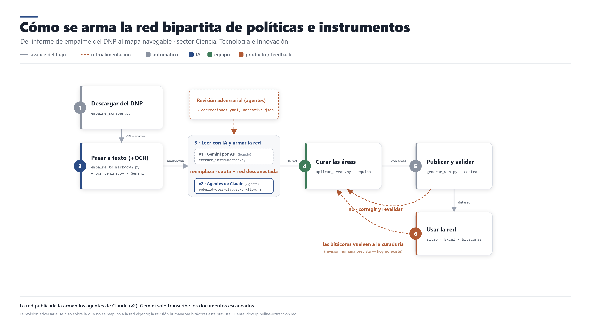

# Cómo lo hicimos: metodología y uso de IA

> [ADR-0006](decisiones/ADR-0006-declarar-uso-de-ia-paso-a-paso.md) ·
> [ADR-0007](decisiones/ADR-0007-metodologia-como-receta-y-glosario-en-orden.md). En el sitio es la
> página **«Cómo lo hicimos»** (`#/metodologia`). El contenido vive en `web/src/lib/metodologia.ts`:
> si cambia uno, cambia el otro. El detalle técnico está en
> [`pipeline-extraccion.md`](pipeline-extraccion.md).

## Advertencia

**Este contenido se generó con inteligencia artificial y aún no se ha revisado al 100 %.** La IA
produjo la red, los textos y los materiales. Puede haber errores de clasificación, de cifras o de
citas.

Es parte del ejercicio. La IA no construye el mapa por nosotros: entrega un primer borrador
desechable, un insumo en bruto. La inteligencia la ponemos las personas —ver otros patrones, notar lo
sutil, discutir el método y marcar dónde no se cumple y qué falta agregar. Es **inteligencia
amplificada, no artificial**: la máquina no piensa en nuestro lugar, nos da más alcance; el timón lo
llevamos nosotros. Cada error que encuentren mejora el mapa.

## Las categorías: qué le preguntamos a cada informe

Un texto se vuelve red cuando se decide antes qué buscar en él. Estas preguntas convierten cada
informe en puntos (políticas e instrumentos) y en líneas (las relaciones).

| Qué se busca | Pregunta | Valores |
|---|---|---|
| Política pública | ¿Sobre qué problema público actúa el Estado? | Un área que atraviesa gobiernos, con el objetivo que declara cada uno |
| Cambio del objetivo | ¿Cambió lo que se busca en esa área? | se mantiene · se reformula · no declarado · nuevo |
| Instrumento | ¿Con qué actúa el Estado? | Un programa, una norma, un fondo, un sistema o una convocatoria, con nombre propio |
| Tipo de instrumento (NATO) | ¿Qué recurso del Estado usa? | nodalidad · autoridad · tesoro · organización |
| Presencia | ¿Cómo aparece en el informe de cada gobierno? | propuesto · logrado · pendiente |
| Modo de cambio | ¿Qué le pasó entre un gobierno y el otro? | continuidad estable · conversión · estratificación · terminación · reversión · deriva |
| Relación | ¿Cómo se conecta con otro instrumento? | habilita · financia · depende de · encadena |
| Evidencia | ¿Dónde lo dice el informe? | La página y la cifra, tal cual, y qué tan segura es la lectura: alta, media o baja |

En la página, los valores salen del mismo vocabulario que usa la red (`data/schema/taxonomia.yaml`)
y cada categoría enlaza su entrada del glosario.

## La receta, de un vistazo

El diagrama muestra el camino completo: de los informes del DNP a la red, con los puntos donde algo
vuelve atrás para corregirse —la revisión con IA, la validación del contrato y las bitácoras del
taller. El detalle de cada paso —y el script de [`extraccion/`](../extraccion) que lo corre— está en
[`pipeline-extraccion.md`](pipeline-extraccion.md).

## Qué está revisado

| Parte | Quién la hizo | Revisión |
|---|---|---|
| Informes de empalme | Las entidades de cada gobierno; los publica el DNP | Fuente oficial |
| Texto de los escaneados | Gemini | Sin revisión humana |
| La red | Agentes de Claude | Sin revisión humana. Casi todos los instrumentos citan su página; hay descripciones que contradicen su modo de cambio |
| Áreas de política | Propuestas por la IA | Parcial: el equipo aprobó cómo se dividieron, no el contenido |
| Textos del sitio y glosario | Claude, a partir de nuestro encuadre | Revisión parcial. Las definiciones teóricas se contrastaron con resúmenes de la literatura; falta cotejarlas con los originales |
| Ejemplo de bitácora CTeI | El equipo; la IA lo pasó a la versión 4 | Parcial: lo nuevo de la versión 4 (motivo, expectativa, relevancia, aportes, complejidad) lo redactó la IA y no se ha revisado |
| Bitácoras de los grupos | Los grupos | Escritas por personas |

La fuente de verdad es `CAPAS` en `web/src/lib/metodologia.ts`. Ninguna parte cambia de estado
hasta que una persona la revise de verdad.

## Mantenerla al día

- Si cambia cómo se extrae la red, se actualizan el diagrama (`docs/img/pipeline-red-bipartita.*`),
  esta página y `pipeline-extraccion.md`.
- El texto público pasa al final por el agente **editor** (`.claude/agents/editor.md`), que busca
  redundancia, jerga e ideas borrosas.
