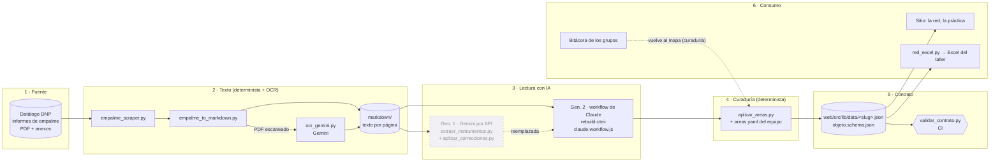

# El pipeline de extracción: de los informes de empalme al grafo

> Cómo se obtuvo la red política↔instrumento que publica el sitio, visto como sistema completo: de
> dónde sale el dato, qué lo transforma, quién decide en cada paso y a dónde llega. Complementa
> [FRONTERAS](FRONTERAS.md) (las reglas entre sistemas), [ontologia](ontologia.md) (qué significa
> cada nodo) y [metodologia](metodologia.md) (el paso a paso con los prompts, para el público).

## En una frase

Los informes de empalme del DNP se descargan y se pasan a texto. La IA lee ese texto y propone
políticas, instrumentos, su tipo (NATO), su cambio entre gobiernos y la página que lo respalda. El
equipo agrupa las políticas en áreas. Un contrato de datos valida el resultado, y el sitio y el
Excel del taller lo consumen.

La lectura con IA se hizo dos veces:
- **primero con Gemini por API**, con scripts de Python;
- **después con un workflow de agentes de Claude**, que es la fuente vigente.

## El sistema completo



| Etapa | Qué hace | Quién decide | Sale |
|---|---|---|---|
| 1 · Fuente | Los informes que cada gobierno entrega al siguiente, publicados por el DNP. | — | PDF y anexos (`descargas/`, `extraido/`, no versionados) |
| 2 · Texto | Descarga, conversión a texto por página y OCR de los escaneados. | Automático; OCR con IA | `markdown/` (no versionado) |
| 3 · Lectura con IA | Propone políticas, instrumentos, tipo NATO, presencia, modo de cambio, relaciones, narrativa y páginas. | IA; el equipo valida el resultado a nivel de red | `objetos.json` del sector |
| 4 · Curaduría | Agrupa las políticas de cada gobierno en **áreas persistentes** con el objetivo de cada uno (ADR-0004). | El equipo (`areas.yaml`) | El dataset con áreas |
| 5 · Contrato | El dataset commiteado que importa la web; CI lo valida contra el schema. | Automático | `web/src/lib/data/<slug>.json` |
| 6 · Consumo | La red del sitio, la práctica, el Excel del taller. Las bitácoras de los grupos vuelven por curaduría. | — | Sitio y materiales |

**Qué es determinista y qué no.** Las etapas 1, 2 (salvo el OCR), 4, 5 y 6 dan siempre el mismo
resultado con la misma entrada, y se pueden volver a correr gratis. La etapa 3 y el OCR usan IA: son
pagos, no son reproducibles al pie de la letra y solo se corren con autorización del PO.

## Etapas 1 y 2: de la fuente al texto

- **`empalme_scraper.py`** recorre el API público del Datálogo del DNP (vigencias → sectores →
  entidades → URLs) y descarga los PDF y los ZIP de anexos, con pausas y reintentos. `mapear`
  enumera sin descargar; `descargar --sector "Ciencia"` baja un sector.
- **`empalme_to_markdown.py`** convierte cada PDF a texto por página (`## Página N`, con PyMuPDF) y
  resume cada hoja de cálculo (dimensiones, encabezados y una muestra). Los PDF sin texto quedan
  marcados como escaneados.
- **`ocr_gemini.py`** transcribe esos escaneados con Gemini. La instrucción pide transcribir completo,
  sin comentarios, y marcar `[página ilegible]`. Nadie revisó esas transcripciones línea a línea.

Para CTeI, la lectura usó los dos informes principales de MinCiencias (2018–2022 y 2022–2026) y sus
anexos para buscar cifras.

## Etapa 3: la lectura con IA, en dos generaciones

### Generación 0 (descartada): la capa de «ideas»

El primer diseño extraía **ideas** sueltas por informe (`extraer_ideas.py`, Gemini) y luego las
consolidaba en instrumentos (`consolidar_objetos.py`). Se abandonó el 26 de septiembre: el
vocabulario del encuadre (instrumentos NATO y modos de cambio) permitía ir directo del texto a
instrumentos. Ambos scripts quedan como referencia histórica (`idea.schema.json`, deprecado).

### Generación 1: Gemini por API (26–27 de septiembre, legado)

**`extraer_instrumentos.py`** llama al API de Gemini con salida estructurada (`responseSchema`) y
valida cada respuesta. Tiene tres etapas:

1. **A · por vigencia.** Lee el informe principal de cada gobierno y devuelve sus políticas y sus
   instrumentos, con tipo NATO, presencia (propuesto, logrado o pendiente), páginas y cifras.
2. **B1 · resolución de entidades.** Une el mismo instrumento entre los dos gobiernos en un catálogo
   canónico, con alias.
3. **B2 · relaciones y modo de cambio.** Agrega las relaciones entre instrumentos (habilita,
   financia, depende de, encadena) y el modo de cambio de los que están en ambos gobiernos.
   - Terminación y estratificación salen de la presencia, sin IA.
   - Continuidad, conversión, reversión y deriva las juzga la IA.

Las etapas A y B1 guardan caché para no volver a pagar. **`aplicar_correcciones.py`** aplicaba
después un overlay de correcciones (`data/correcciones/<slug>/correcciones.yaml` y `narrativa.json`).
Esas correcciones salieron de una revisión adversarial con agentes de IA contra los informes, con su
evidencia en `revision.json`. El patrón corregido: el pipeline marcaba de más «terminación» en
normas y sistemas que en realidad continuaron.

**Por qué se reemplazó.**
- Límites de cuota del API.
- Una calidad insuficiente: la corrida con el modelo más liviano dejó la red casi desconectada. Los
  fondos y sistemas que sirven a muchas políticas quedaban asignados a una sola, y el grafo bipartito
  se partía en islas.

### Generación 2: el workflow de Claude (27 de septiembre, vigente)

**`rebuild-ctei-claude.workflow.js`** es un workflow multi-agente que se ejecuta con Claude Code, sin
Gemini y sin scripts de Python intermedios. Los agentes leen directamente los archivos de texto de los
informes (buscan y abren páginas) y devuelven JSON con un esquema fijo. Tiene cuatro fases:

1. **Descubrir.** Un agente lista las políticas del sector en los dos informes, con nombre y objetivo.
   Se le indica qué familias buscar: misiones, formación, apropiación social, internacionalización,
   gobernanza, sofisticación productiva, IA, beneficios tributarios y bioeconomía.
2. **Extraer.** **Un agente por política**, en paralelo, extrae sus instrumentos en los dos gobiernos.
   Para cada uno anota:
   - tipo NATO y presencia por gobierno;
   - un modo de cambio **guiado por evidencia**, comparando nombres, lógica y cifras, no por defecto;
   - páginas y cifras literales, con la instrucción de no inventar;
   - entidades y alias;
   - una narrativa por gobierno;
   - `tambien_sirve_a`: las otras políticas a las que sirve el instrumento. Es la clave para que
     fondos y sistemas conecten la red.
3. **Consolidar.** Un agente une el mismo instrumento cuando aparece en varias políticas o gobiernos,
   con reglas explícitas. Sí fusiona el mismo fondo, sistema o programa renombrado. No fusiona
   instrumentos que solo comparten tema, ni una convocatoria con un programa permanente.
   - El ensamblado posterior es **código determinista**. Toma la presencia más fuerte y define
     terminación o estratificación por presencia.
   - Solo cuando el instrumento está en los dos gobiernos usa el modo que propuso el agente.
   - Une las evidencias y los alias de todos los que fusionó.
4. **Relaciones.** Un agente identifica relaciones dirigidas entre instrumentos distintos. Se
   descartan las que apuntan a ids inexistentes y las de un instrumento consigo mismo.

**Resultado:** 19 políticas por gobierno, 95 instrumentos, 52 instrumentos «puente» (sirven a más
de una política), 28 relaciones y 21 instrumentos presentes en ambos gobiernos. La red recuperó la
conectividad: el Fondo Francisco José de Caldas enlaza 13 políticas y el SGR 12.

**Lo que no tuvo esta generación.** La revisión adversarial y el overlay de correcciones de la
generación 1 **no se aplicaron** a esta red. Se hicieron sobre la versión de Gemini, antes de la
reconstrucción, y no se volvieron a correr. Hoy la red vigente no tiene revisión humana dato por dato.
Hay casos conocidos en que la narrativa de un instrumento contradice su modo de cambio (por eso la
práctica del sitio los evita).

## Etapa 4: la curaduría de áreas

La IA entrega **políticas por gobierno**: cada informe nombra las suyas. El laboratorio necesita
**áreas** que atraviesen gobiernos, para comparar (ADR-0004). **`aplicar_areas.py`** aplica, sin IA,
la curaduría del equipo en `data/correcciones/<slug>/areas.yaml`:

- cada área agrupa las políticas que cada gobierno declaró sobre el mismo problema, y guarda sus
  enunciados tal cual;
- `cambio_objetivo` clasifica el cambio del objetivo: se mantiene, se reformula, nuevo o no
  declarado;
- `absorbe_nodos` elimina nodos-objetivo que duplicaban una misión;
- falla si una política queda sin área o si un área cita una política inexistente.

Criterios que acordó el PO: cada misión es un área, y apropiación social y ciencia abierta van por
separado. Resultado para CTeI: 19 políticas → **14 áreas** (3 se reformulan, 4 se mantienen, 1 no
declarada, 6 nuevas). Quedan **93 instrumentos y 22 relaciones**, porque las relaciones con los
nodos absorbidos pasan a ser pertenencia al área.

## Etapa 5: el contrato

**`generar_web.py`** copia el dataset a `web/src/lib/data/<slug>.json`. Ese archivo está
**commiteado a propósito**: la web lo importa como módulo, sin fetch, y así sirve en GitHub Pages y
abriendo el build desde el disco.

**`scripts/validar_contrato.py`** corre en CI y verifica:
- que el dataset cumple `data/schema/objeto.schema.json`;
- que los vocabularios salen de `taxonomia.yaml`;
- que el Excel y las bitácoras publicadas están al día.

Es la frontera entre extracción y web: la web nunca importa ni ejecuta `extraccion/`
([FRONTERAS](FRONTERAS.md)).

## Etapa 6: quién consume el grafo

- **El sitio**: la red (`packages/red` construye la red, filtra y enfoca; la web la dibuja con D3) y
  la práctica «¿Qué le pasó a este instrumento?».
- **`red_excel.py`**: la misma red en Excel para el taller, con hojas Léeme, Resumen (con fórmulas),
  Políticas, Instrumentos y Relaciones. La hoja Léeme lleva la advertencia de uso de IA.
- **La bitácora de los grupos** (`bitacora.py`, ADR-0005): no modifica el grafo automáticamente. El
  equipo lee lo que aportan los grupos y, si corresponde, lo lleva a `areas.yaml` o al dataset. Es
  el lazo de revisión humana que falta.

## Cómo reproducirlo

```bash
# 1–2 · fuente y texto (el OCR usa Gemini: API paga, con autorización)
uv run extraccion/empalme_scraper.py descargar --sector "Ciencia"
uv run extraccion/empalme_to_markdown.py
uv run extraccion/ocr_gemini.py

# 3 · lectura con IA (paga, con autorización del PO)
#   vigente: el workflow de Claude, desde Claude Code (extraccion/rebuild-ctei-claude.workflow.js)
#   legado:  uv run extraccion/extraer_instrumentos.py --slug ciencia-tecnologia --match Ciencia
#            && uv run extraccion/aplicar_correcciones.py --slug ciencia-tecnologia

# 4–6 · deterministas, gratis
uv run extraccion/aplicar_areas.py --slug ciencia-tecnologia
uv run extraccion/generar_web.py --slug ciencia-tecnologia
uv run extraccion/red_excel.py --slug ciencia-tecnologia
uv run scripts/validar_contrato.py
```

Los datos crudos e intermedios (`descargas/`, `extraido/`, `markdown/`, `data/sectores/`) no están
en el repositorio: se regeneran. Lo versionado es la curaduría (`data/correcciones/`), el dataset que
consume la web y los scripts.

## Límites conocidos

- **La red vigente no tiene revisión humana completa** (ver «Qué está revisado» en
  [metodologia](metodologia.md)). Las correcciones verificadas son de la generación 1.
- **La lectura con IA no es reproducible exacta:** otra corrida puede dar otra red. Por eso el
  dataset se versiona y la curaduría vive aparte, en archivos que se reaplican sin IA.
- **La resolución de entidades entre gobiernos** puede fusionar de más o de menos.
- **Un solo sector (CTeI).** Escalar a otro requiere descargar sus informes, correr la lectura y
  curar sus áreas.
