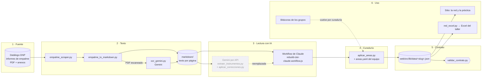

# El pipeline de extracción: de los informes de empalme al grafo

> Cómo se obtuvo la red que publica el sitio: de dónde sale el dato, qué lo transforma, quién decide
> y a dónde llega. Complementa [FRONTERAS](FRONTERAS.md), [ontologia](ontologia.md) y
> [metodologia](metodologia.md).

## En una frase

Los informes de empalme que publica el Departamento Nacional de Planeación (DNP) se descargan y se
pasan a texto. La IA lee ese texto y propone:
- políticas e instrumentos;
- el tipo de cada instrumento según el recurso que usa (NATO: nodalidad, autoridad, tesoro u
  organización);
- su cambio entre gobiernos y la página que lo respalda.

El equipo agrupa las políticas en áreas. Una comprobación automática valida el resultado, y el sitio
y el Excel del taller lo usan.

La lectura con IA tuvo tres versiones. La primera se descartó enseguida. La segunda usó **Gemini por
API** y la tercera, **agentes de Claude coordinados por un workflow**. Esta última produjo la red
publicada.

## El sistema completo



| Etapa | Qué hace | Quién decide | Sale |
|---|---|---|---|
| 1 · Fuente | Descarga los informes que cada gobierno entregó al siguiente. | — | PDF y anexos (`descargas/`; los ZIP de anexos se descomprimen aparte en `extraido/`) |
| 2 · Texto | Pasa cada documento a texto por página; transcribe los escaneados (OCR). | Automático; el OCR usa IA | `markdown/` |
| 3 · Lectura con IA | Propone políticas, instrumentos, tipo, presencia, modo de cambio, relaciones, narrativa y páginas. | La IA. El equipo revisó la forma general de la red, no cada dato | `data/sectores/<slug>/objetos.json` |
| 4 · Curaduría | Agrupa las políticas de cada gobierno en áreas que atraviesan gobiernos (ADR-0004). | El equipo (`areas.yaml`) | El mismo archivo, con áreas |
| 5 · Contrato | Copia el dataset al sitio; una comprobación automática revisa su formato en cada cambio. | Automático | `web/src/lib/data/<slug>.json` |
| 6 · Uso | La red del sitio, la práctica y el Excel del taller. | — | Sitio y materiales |

Las carpetas `descargas/`, `extraido/`, `markdown/` y `data/sectores/` no están en el repositorio:
se regeneran. Lo que sí se versiona es la curaduría (`data/correcciones/`), el dataset del sitio y los
scripts.

**Qué es determinista y qué no.** Las etapas 2 (salvo el OCR), 4, 5 y 6 dan el mismo resultado con
la misma entrada y se pueden volver a correr gratis. La etapa 1 depende de lo que el DNP publique en
ese momento. La etapa 3 y el OCR usan IA: son pagos, otra corrida puede dar otra red, y solo se
corren con autorización de quien dirige el proyecto (PO).

## Etapas 1 y 2: de la fuente al texto

- **`empalme_scraper.py`** recorre el API público del Datálogo del DNP (vigencias → sectores →
  entidades → enlaces) y descarga los PDF y los ZIP de anexos, con pausas y reintentos.
- **`empalme_to_markdown.py`** convierte cada PDF a texto por página (`## Página N`) y resume cada
  hoja de cálculo: dimensiones, encabezados y una muestra de filas. Marca los PDF sin texto como
  escaneados.
- **`ocr_gemini.py`** transcribe esos escaneados con Gemini. Nadie revisó las transcripciones línea
  a línea.

Para Ciencia, Tecnología e Innovación (CTeI), la lectura usó los dos informes principales de
MinCiencias (2018–2022 y 2022–2026). Los anexos sirvieron para buscar cifras.

## Etapa 3: la lectura con IA

### Versión 1 (descartada): la capa de «ideas»

El primer diseño extraía **ideas** sueltas de cada informe con Gemini (`extraer_ideas.py`) y luego
las agrupaba en instrumentos (`consolidar_objetos.py`). Se abandonó al adoptar el vocabulario del
encuadre (tipos NATO y modos de cambio), que permitía ir directo del texto a los instrumentos. Los
dos scripts quedan como referencia histórica.

### Versión 2 (legado): Gemini por API

**`extraer_instrumentos.py`** le pide a Gemini respuestas con un esquema fijo y valida cada una.
Tiene tres etapas:

1. **A · por gobierno.** Lee el informe principal de cada gobierno y devuelve sus políticas e
   instrumentos, con tipo NATO, presencia (propuesto, logrado o pendiente), páginas y cifras.
2. **B1 · unir entidades.** Une el mismo instrumento entre los dos gobiernos en un catálogo único,
   con sus nombres alternativos.
3. **B2 · relaciones y modo de cambio.** Agrega las relaciones entre instrumentos (habilita,
   financia, depende de, encadena) y el modo de cambio.
   - Terminación y estratificación salen de la presencia, sin IA.
   - Continuidad, conversión, reversión y deriva las juzga la IA.

Las etapas A y B1 guardan su resultado para no volver a pagar.

Después, **`aplicar_correcciones.py`** aplicaba encima una capa de correcciones
(`data/correcciones/ciencia-tecnologia/correcciones.yaml` y `narrativa.json`). Esas correcciones
salieron de una revisión en la que otros agentes de IA buscaron errores contra los informes; la
evidencia está en `data/correcciones/ciencia-tecnologia/revision.json`.
- El error principal: el pipeline marcaba de más «terminación» en normas y sistemas que continuaron.
- También fusionó, separó y deduplicó instrumentos y políticas.

**Por qué se reemplazó** (según el equipo y los mensajes de commit): límites de cuota del API y
calidad. La corrida con la variante más liviana de Gemini dejó la red casi desconectada: los fondos
y sistemas que sirven a muchas políticas quedaban en una sola, y el grafo se partía en islas.

### Versión 3 (vigente): el workflow de Claude

**`rebuild-ctei-claude.workflow.js`** es un workflow multi-agente que se ejecuta con Claude Code, sin
Gemini. Los agentes abren y buscan directamente en los textos de los informes y devuelven JSON con un
esquema fijo. El workflow devuelve el dataset pero no lo escribe: hay que guardar su salida como
`data/sectores/<slug>/objetos.json`.

Tiene cinco pasos:

1. **Descubrir (un agente).** Lista las políticas del sector en los dos informes, con nombre y
   objetivo. Se le indica qué familias buscar: misiones, formación, apropiación social,
   internacionalización, gobernanza, sofisticación productiva, IA, beneficios tributarios y
   bioeconomía.
2. **Extraer (un agente por política, en paralelo).** Extrae los instrumentos de esa política en los
   dos gobiernos. Para cada uno anota:
   - tipo NATO y presencia por gobierno;
   - un modo de cambio que debe justificar comparando nombres, lógica y cifras;
   - páginas y cifras literales, con la instrucción de no inventar;
   - entidades y nombres alternativos;
   - una narrativa por gobierno;
   - `tambien_sirve_a`: las otras políticas a las que sirve. Es la clave para que fondos y sistemas
     conecten la red.
3. **Consolidar (un agente).** Une el mismo instrumento cuando aparece en varias políticas o
   gobiernos, y unifica las políticas equivalentes de los dos informes. Sí fusiona el mismo fondo,
   sistema o programa renombrado. No fusiona instrumentos que solo comparten tema, ni una
   convocatoria con un programa permanente.
4. **Ensamblar (código, sin IA).** Arma cada instrumento a partir de los que se fusionaron:
   - toma la presencia más fuerte de cada gobierno;
   - si el instrumento está en un solo gobierno, el modo es terminación o estratificación;
   - si está en los dos, usa el primer modo válido que propuso algún agente. **Si ninguno propuso uno,
     pone «conversión» por defecto**;
   - si ninguno trae presencia, lo da por presente en 2018–2022 (y termina en «terminación»);
   - la narrativa sale del primer instrumento fusionado que la tenga. Puede no ser el mismo que
     aportó el modo.
5. **Relaciones (un agente).** Identifica relaciones dirigidas entre instrumentos distintos. Se
   descartan las que apuntan a instrumentos inexistentes o a sí mismos.

**Resultado** (según el commit de la reconstrucción):
- 19 políticas en un solo catálogo para los dos informes (varias aparecen en ambos);
- 95 instrumentos, 21 de ellos presentes en ambos gobiernos;
- 52 instrumentos «puente», que sirven a más de una política;
- 28 relaciones.

La red recuperó la conectividad: el Fondo Francisco José de Caldas enlaza 13 políticas y el Sistema
General de Regalías (SGR), 12.

**Lo que no tuvo esta versión.** La revisión con agentes y las correcciones de la versión 2 **no se
aplicaron** a esta red. Se hicieron antes de la reconstrucción y no se volvieron a correr. La red
vigente no tiene revisión humana dato por dato. Hay casos conocidos en que la narrativa de un
instrumento contradice su modo de cambio; el ensamblado del paso 4 es una causa probable. Por eso el
ejercicio «¿Qué le pasó a este instrumento?» del sitio no los usa.

## Etapa 4: la curaduría de áreas

Cada informe nombra sus propias políticas. El laboratorio necesita **áreas** que atraviesen
gobiernos, para poder comparar (ADR-0004). **`aplicar_areas.py`** aplica, sin IA, la curaduría del
equipo que está en `data/correcciones/<slug>/areas.yaml`:

- cada área agrupa las políticas que cada gobierno declaró sobre el mismo problema, y guarda sus
  objetivos tal cual;
- `cambio_objetivo` clasifica el cambio del objetivo: se mantiene, se reformula, nuevo o no
  declarado;
- `absorbe_nodos` quita dos nodos que representaban el objetivo de una misión, no un instrumento,
  porque la misión ya es el área;
- el script falla si una política queda sin área o si un área cita una política que no existe.

El script **reescribe** `objetos.json` y no se puede correr dos veces sobre el mismo archivo: se
detiene si el dataset ya tiene áreas.

Criterios acordados con la dirección del proyecto: cada misión es un área, y apropiación social y ciencia abierta van por
separado. Resultado para CTeI:
- 19 políticas → **14 áreas**: 3 se reformulan, 4 se mantienen, 1 no declarada y 6 nuevas;
- **93 instrumentos**, porque se quitan los 2 absorbidos;
- **22 relaciones**, porque las que tocaban esos nodos pasan a ser pertenencia al área.

## Etapa 5: el contrato

**`generar_web.py`** copia el dataset a `web/src/lib/data/<slug>.json`. Ese archivo se guarda en el
repositorio a propósito: el sitio lo incluye al construirse, sin pedir datos a un servidor. Así
funciona en GitHub Pages y también abriendo una copia local.

**`scripts/validar_contrato.py`** corre en cada cambio y verifica:
- que el dataset cumple `data/schema/objeto.schema.json`;
- que `taxonomia.yaml` se lee sin errores. Los valores permitidos están copiados en el schema;
  ningún script compara las dos listas;
- que el Excel y las bitácoras publicadas están al día.

Es la frontera entre la extracción y el sitio: el sitio nunca importa ni ejecuta `extraccion/`
([FRONTERAS](FRONTERAS.md)).

## Etapa 6: quién usa el grafo

- **El sitio.** `packages/red` construye la red, la filtra y la enfoca; la web la dibuja. También
  alimenta el ejercicio «¿Qué le pasó a este instrumento?».
- **`red_excel.py`.** La misma red en Excel para el taller, con las hojas Léeme, Resumen (con
  fórmulas), Políticas, Instrumentos y Relaciones. Compara sus etiquetas contra `taxonomia.yaml`, y
  la hoja Léeme lleva la advertencia de uso de IA.
- **Las bitácoras de los grupos** (`bitacora.py`, ADR-0005). No modifican el grafo solas: el equipo
  lee lo que aportan y, si corresponde, lo lleva a `areas.yaml` o al dataset. Es la vía prevista para
  la revisión humana que hoy no existe.

## Cómo reproducirlo

```bash
# 1–2 · fuente y texto (el OCR usa Gemini: pago, con autorización)
uv run extraccion/empalme_scraper.py descargar --sector "Ciencia"
#   (descomprimir los ZIP de anexos en extraido/)
uv run extraccion/empalme_to_markdown.py
uv run extraccion/ocr_gemini.py

# 3 · lectura con IA (pago, con autorización del PO)
#   vigente: correr extraccion/rebuild-ctei-claude.workflow.js desde Claude Code
#            y guardar su salida en data/sectores/ciencia-tecnologia/objetos.json
#   legado:  uv run extraccion/extraer_instrumentos.py --slug ciencia-tecnologia --match Ciencia
#            && uv run extraccion/aplicar_correcciones.py --slug ciencia-tecnologia

# 4–6 · deterministas, gratis
uv run extraccion/aplicar_areas.py --slug ciencia-tecnologia   # una sola vez por objetos.json
uv run extraccion/generar_web.py --slug ciencia-tecnologia
uv run extraccion/red_excel.py --slug ciencia-tecnologia
uv run scripts/validar_contrato.py
```

## Límites conocidos

- **Sin revisión humana completa.** Ver «Lo que no tuvo esta versión», en la etapa 3.
- **Otra corrida de la IA puede dar otra red.** Por eso el dataset se versiona y la curaduría vive
  aparte, en archivos que se reaplican sin IA.
- **La unión de instrumentos entre gobiernos** puede fusionar de más o de menos.
- **Un solo sector (CTeI).** Escalar a otro requiere descargar sus informes, correr la lectura y curar
  sus áreas.
